# UNREAL ENGINE 4 - BLUEPRINTS INTERMEDIÁRIO

## CONTROLE DA LUZ USANDO TIMELINE

## TIMELINE

Os nós da linha de tempo são nós especiais dentro de Blueprints que permitem que uma animação simples baseada em tempo seja projetada e reproduzida rapidamente com base em eventos no jogo. As linhas do tempo são como sequências de matinê simples, pois permitem que valores simples sejam animados e que eventos sejam disparados ao longo do tempo. Eles podem ser editados diretamente dentro do editor Blueprint clicando duas vezes na Linha de tempo na guia Gráfico ou na guia Meu Blueprint. Eles são especificamente construídos para lidar com tarefas simples e não cinematográficas, como abrir portas, alterar luzes ou executar outras manipulações centradas no tempo para atores em uma cena.

## UTILIZANDO A TIMELINE

Para isso, foi criado uma Blueprint tipo Actor para o controle da luz (componente point light):
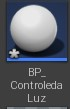

- Criado uma **Variável** do tipo **PointLight** com o nome de "ReferenceLuz" para que o objeto BP_ControledaLuz tenha referência do PointLight inserido no Level.

- Inserido o Actor (BP_ControledaLuz) no level:

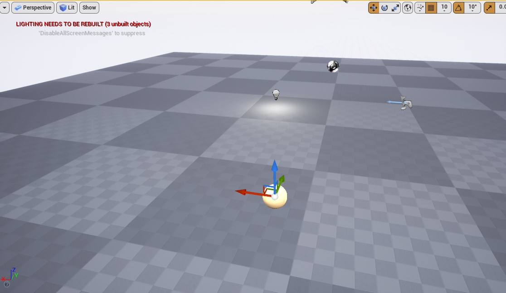

Realizar a referência (conhcecimento da PointLight) ao BP_ControledaLuz;

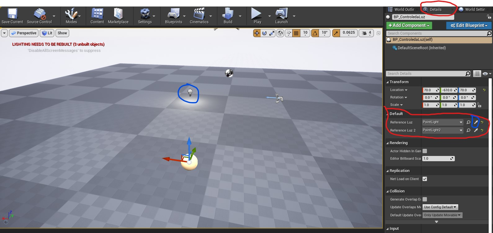

No Event Graph do **BP_ControledaLuz**:

- Adicionar uma Timeline:
  - AddTimeline; 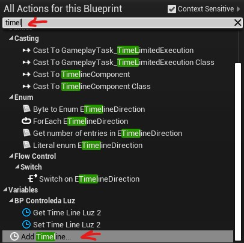

Inserir o nome da TimeLine e em seguida clicar duas vezes em cima da TimeLine:

  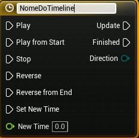

Após clicar na TimeLine:

- Adicionar uma ColorTrack:

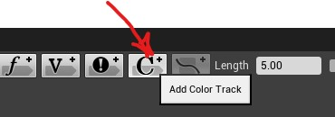

Adicionar os pontos de tempo no Color:

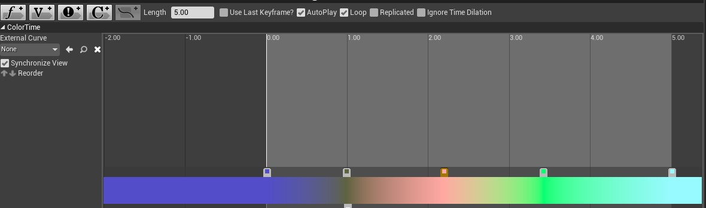

Em cada Ponto, é realizado a escolha da cor desejada:

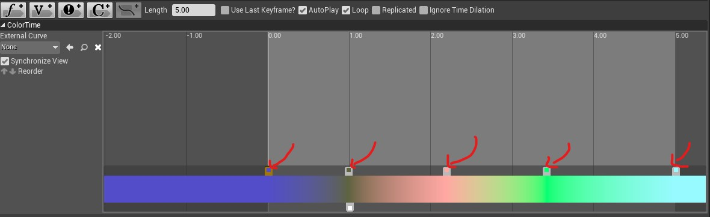

Ao clicar duas vezes em cada ponto, poderá escolher a cor desejada do tempo determinado:

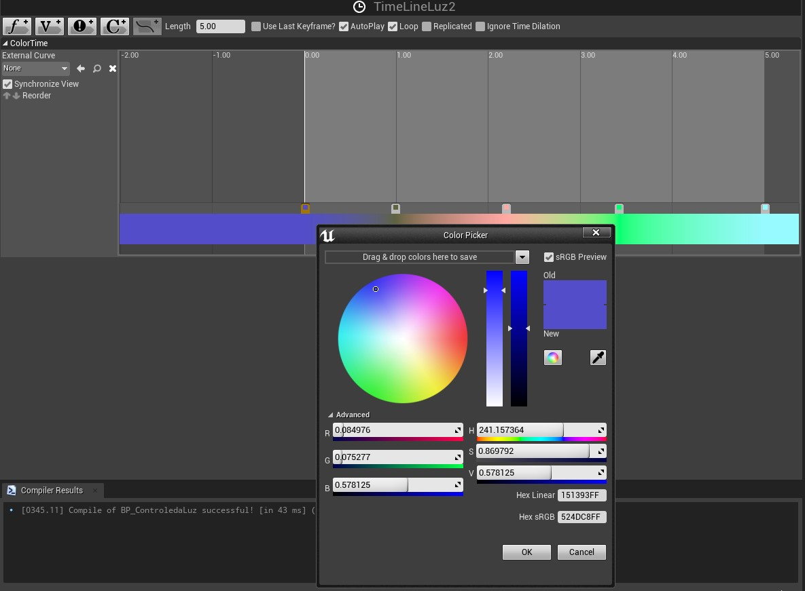

Clicar nas opções **Autoplay** e **Loop**:

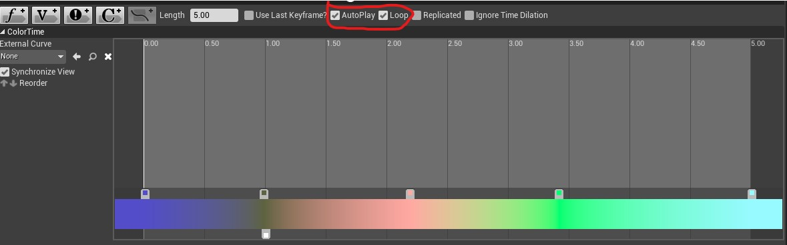

Após a configuração das cores, realizar a implementação da lógica de variação da cor com o TimeLine no **Event Graph** do **BP_ControledaLuz**:

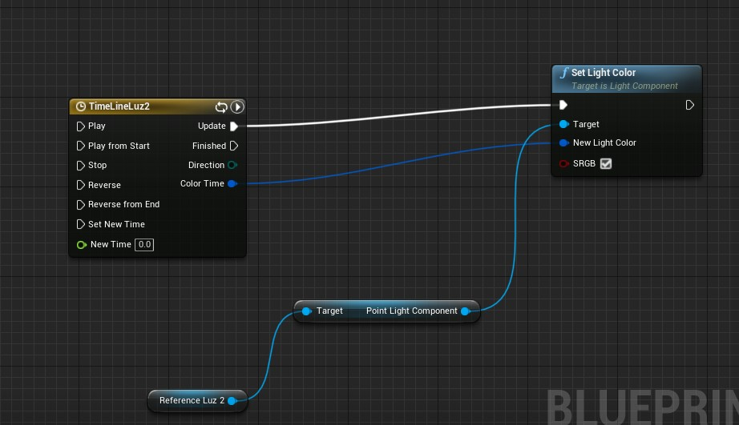

Em seguida, clicar em Play para ver a ação no viewport do Level;
segue o video para conferir o resultado:

[TIMELINE - ATIVIDADE A LUZ](https://www.youtube.com/watch?v=xpLSVvXUmeY)

## UTILIZANDO A TIMELINE PARA MOVIMENTO DE PORTAS

## 1 - Porta deslizante:

 1.1 - Para criar uma porta deslizante na cena, você poderá seguir os seguintes passos:

- Acionar uma porta:
  - Para o exemplo, foi utilizado a SM_Door do StarterContent: 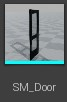

Inserido a SM_Door na cena;

- Clicar no objeto inserido (SM_Door) na cena e converter em Blueprint;

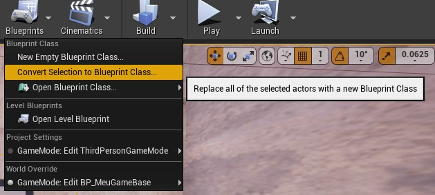

Ao acessar a Blueprint do objeto, inserir uma box colision;

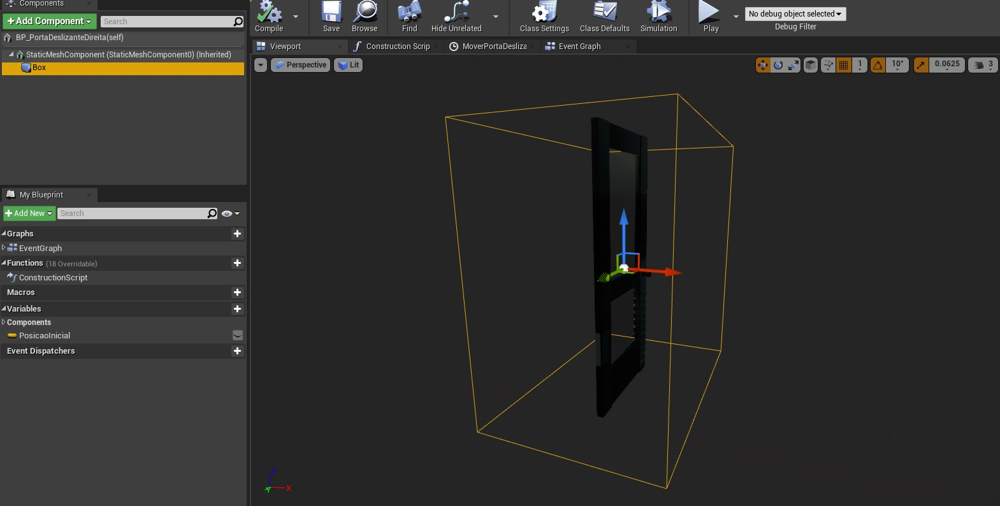

Em seguida salvar e Compilar;

## 2 - Movimento da porta:

2.1 - No Event Graph do objeto:

Para realizar o movimento inicial, é necessário primeiramente que seja conhecido a posição inicial do objeto:

Para isso, é criado uma Variável (TIPO VECTOR) e denominada no exemplo como "PosicaoInicial":

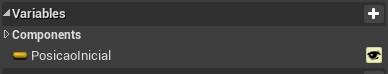

Em seguida, é realizado o conhecimento da posição do objeto na cena:

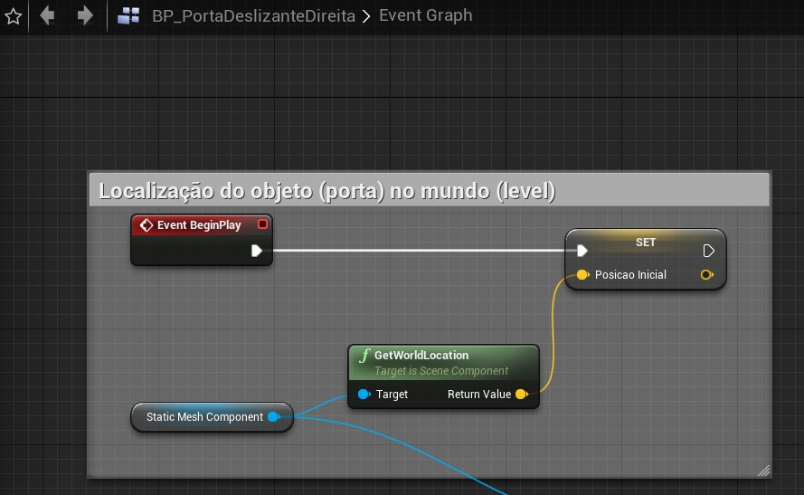

2.2 - Criado um novo Evento (AddCustomEvent) com uma input e combinando com uma Branch para o acionamento da porta;

Depois inserido um Timeline para o tempo da porta com variação no tempo 1 no valor 100 para o movimento de deslize da porta:

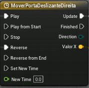

Adicionar os pontos de variação do tempo (keys):

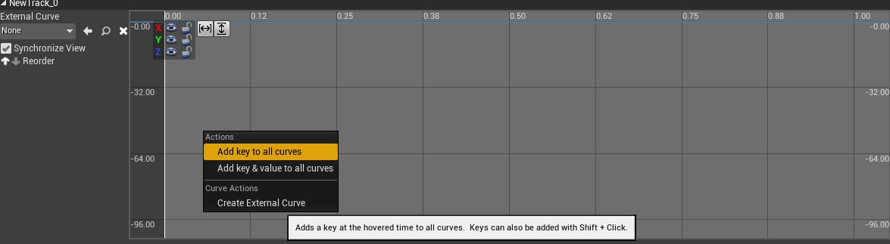

- All key to all curves (adiciona os pontos para os três eixos)

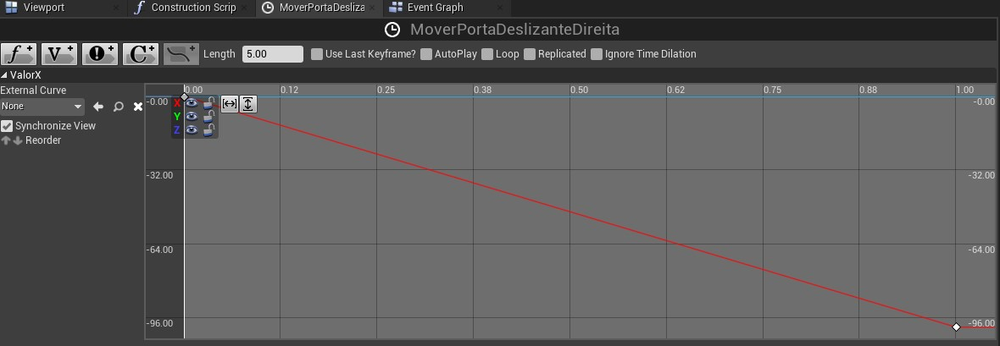

Os eixos Y e Z estão no tempo e valor 0.0 enquanto o eixo X (posição onde irá fazer o movimento) está no tempo 1 no valor 100.

PS: foi inserido dois pontos (keys) apenas no eixo X onde foi feito a variação do tempo.

Como variou apenas no eixo X, Este ponto fica visivel na Timeline:

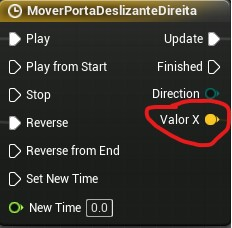

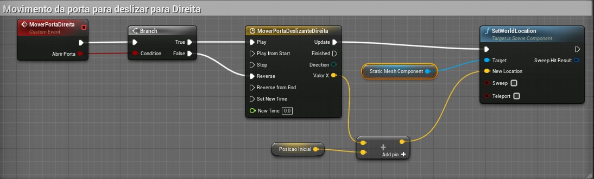

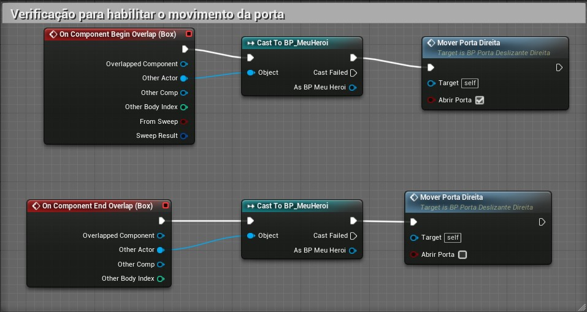

## 3 - Abrindo porta com o **Float Curve**:

3.1 - No content Browser, no botão direito do mouse selecionar o seguinte:

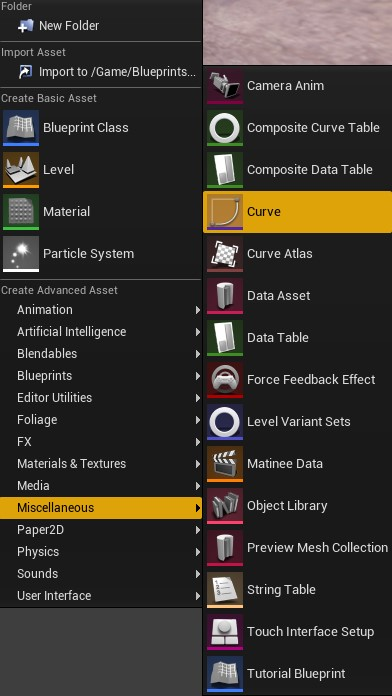

- Add keys (adicionar dois pontos):

Sendo: o primeiro Time: 0 e value: 0;
       o segundo Time: 1 e value: 90;

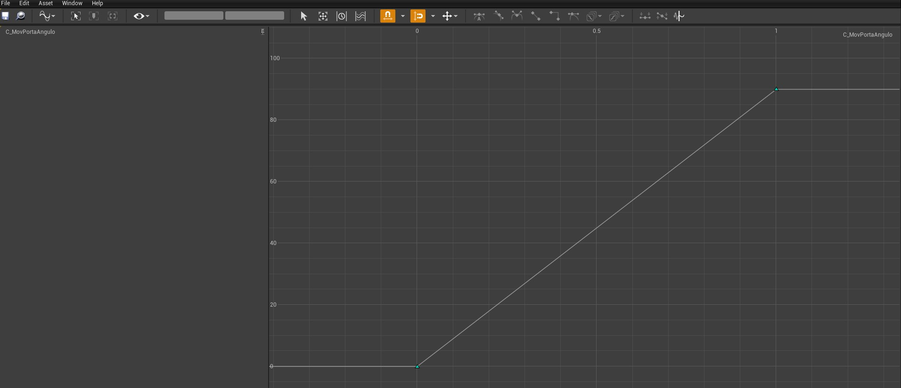

Em seguida, realizar o mesmo procedimento do item 1.1;

Ao iniciar o item 2.1:

- clicar no float curve criado: 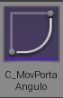

Clicar na lupa para associar a curva criada ao objeto que realizará o movimento:

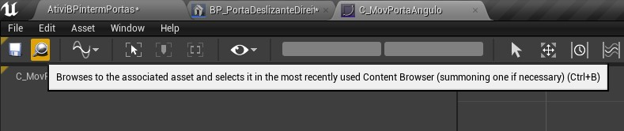

Os procedimentos são semelhantes ao item 2.1, porém na criação da timeline é realizado o procedimento distinto:

Na timeline criada:

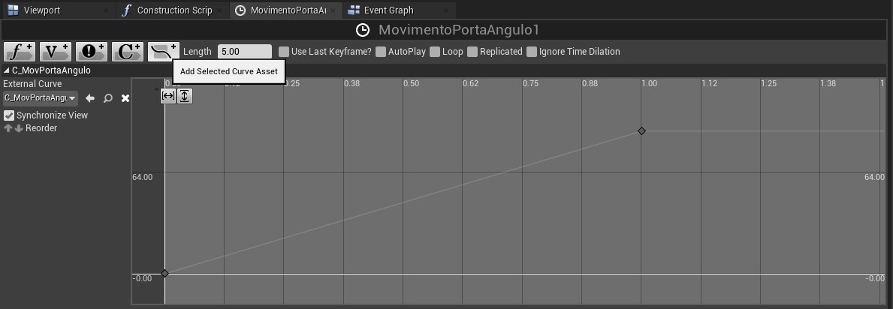

**(Add Select Curve Asset)**

Irá selecionar o Float Curve criado no item 3.1;

Em seguida, Compilar e salvar;

a TimeLine criada ficará assim:

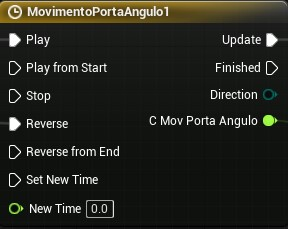

Então para o movimento da porta utilizando o float Curve ficará:

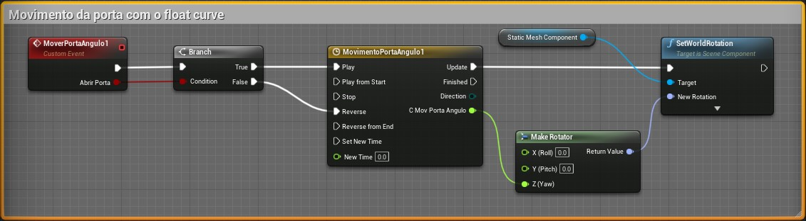

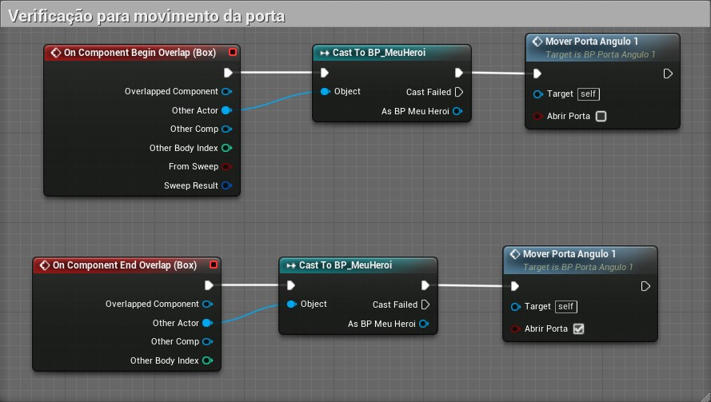

